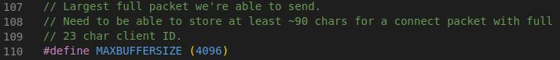

# sample-mqtt-NodeToCloud
Sample MQTT example with ESP8266 NodeMCU and DHT22 (Connected to D3 port)

## Important Note:

Adafruit MQTT Library uses small buffer for MQTT packets. To change this please update the library code after installation.

Go to:

 * \<YourHomePath\>/Arduino/libraries/Adafruit_MQTT_Library/**Adafruit_MQTT.h**
 * Change line 110 to **#define MAXBUFFERSIZE (4096)** it was _150_.

## Arduino Libraries
* NTP Client 3.2.1 [link](https://github.com/arduino-libraries/NTPClient)
* Adafruit MQTT 2.4.3 [link](https://github.com/adafruit/Adafruit_MQTT_Library)
* ArduinoJson 6.19.4 [link](https://github.com/bblanchon/ArduinoJson)
* DHTSensorLibrary 1.4.4 [link](https://github.com/adafruit/DHT-sensor-library)
* Time 1.6.1 [link](https://github.com/PaulStoffregen/Time)

## Board
* esp8266 [link](https://github.com/esp8266/Arduino)
    * Board Manager Url: http://arduino.esp8266.com/stable/package_esp8266com_index.json
    * Tested Board: NodeMCU 0.9 (ESP-12 Module)
    * Upload Speed: 115200
    * CPU Frequency: 80 MHz
    * Flash Size: 4M (1M SPIFFS)
  